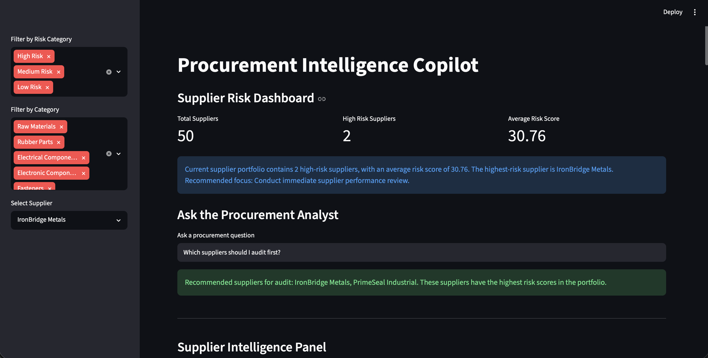
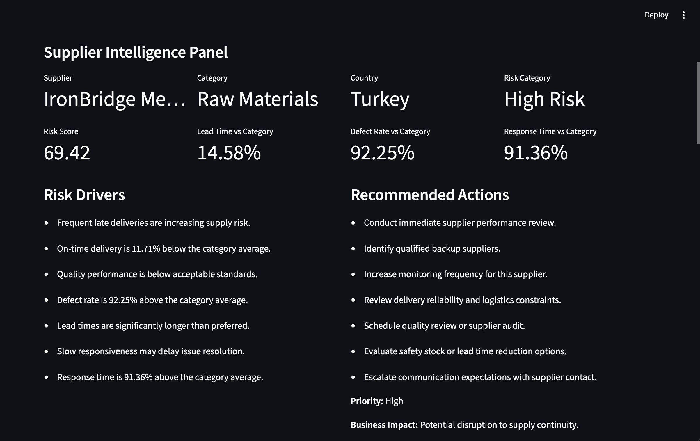

# Procurement Intelligence Copilot

AI-powered procurement analytics and supplier risk decision-support platform.

## Overview

Procurement teams often manage supplier performance through spreadsheets, fragmented reports, and manual reviews.

Procurement Intelligence Copilot provides a structured framework for:

- Evaluating supplier performance
- Identifying supplier risk
- Benchmarking suppliers against category peers
- Explaining risk drivers
- Recommending mitigation actions
- Supporting procurement decision-making

The project demonstrates how analytics, business logic, and AI-ready architectures can improve procurement operations.

---

## Dashboard Overview

Executive-level supplier risk monitoring dashboard with portfolio-wide KPIs, risk summaries, and procurement analytics.



---

## Supplier Intelligence Panel

Detailed supplier analysis including:

- Risk score
- Category benchmarking
- Risk drivers
- Recommended actions
- Business impact assessment



---

## Procurement Analyst

Natural-language procurement assistant capable of answering questions such as:

- Which suppliers should be audited first?
- Which supplier has the highest risk?
- Which category has the highest average risk?
- Which countries present the highest supplier risk?


---

## Key Features

### Supplier Risk Scoring

Evaluates suppliers using:

- On-time delivery
- Defect rates
- Lead times
- Supplier responsiveness
- Price variance

### Category Benchmarking

Compares supplier performance against category averages.

### Risk Explanation Engine

Explains why suppliers are classified as high, medium, or low risk.

### Recommendation Engine

Generates procurement actions including:

- Supplier reviews
- Quality audits
- Alternate supplier identification
- Monitoring recommendations

### Procurement Analyst

Rule-based procurement copilot capable of answering portfolio-level questions.

---

## Tech Stack

### Analytics

- Python
- Pandas
- NumPy

### Visualization

- Streamlit
- Plotly

### Data

- CSV-based procurement dataset

### Architecture

- Modular Python application
- Decision-support architecture
- AI-ready design

---

## System Architecture

```text
Raw Supplier Data
        ↓
Data Loader
        ↓
Category Benchmarking
        ↓
Supplier Risk Scoring
        ↓
Risk Explanation Engine
        ↓
Recommendation Engine
        ↓
Procurement Query Engine
        ↓
Streamlit Dashboard
```

---

## Business Use Case

This project simulates how procurement organizations can identify supply risk before disruptions occur.

Potential applications include:

- Supplier performance management
- Procurement analytics
- Supplier relationship management
- Risk monitoring
- Supply chain resilience initiatives

---

## Future Roadmap

### Version 2

- LLM-powered procurement analyst
- Natural language supplier reports
- Procurement chat interface

### Version 3

- RFQ comparison assistant
- Contract risk extraction
- Supplier diversification analysis
- Supplier portfolio optimization

---

## Author

Lucca Martins

Supply Chain Management | Analytics | Procurement | AI-Enabled Operations

Focused on building intelligent systems that improve operational and procurement decision-making.